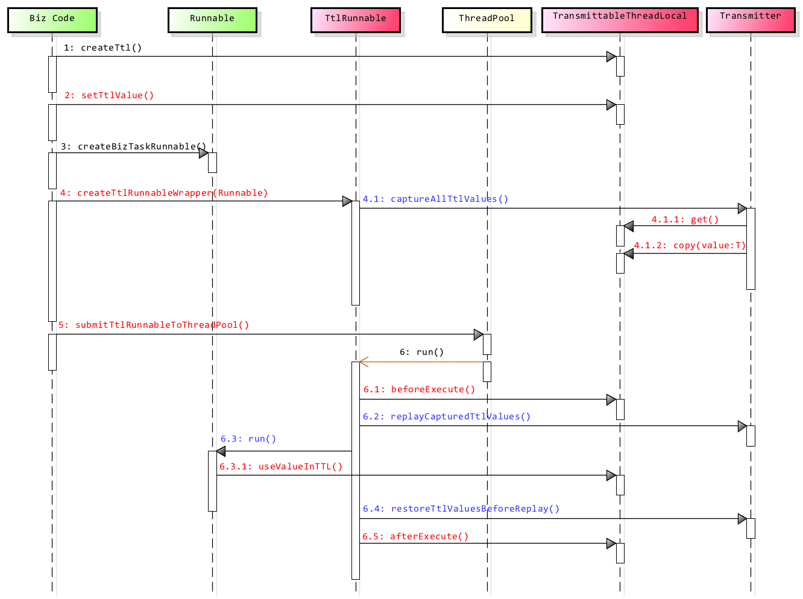

# 📌 TransmittableThreadLocal(TTL) 📌

[](https://travis-ci.org/alibaba/transmittable-thread-local)
[](https://ci.appveyor.com/project/oldratlee/transmittable-thread-local)
[](https://codecov.io/gh/alibaba/transmittable-thread-local/branch/master)
[](https://codeclimate.com/github/alibaba/transmittable-thread-local)  
[](https://www.apache.org/licenses/LICENSE-2.0.html)
[](https://alibaba.github.io/transmittable-thread-local/apidocs/)
[](https://search.maven.org/search?q=g:com.alibaba%20AND%20a:transmittable-thread-local&core=gav)
[ ](https://github.com/alibaba/transmittable-thread-local/releases)  
[](https://gitter.im/alibaba/transmittable-thread-local?utm_source=badge&utm_medium=badge&utm_campaign=pr-badge&utm_content=badge)
[](https://github.com/alibaba/transmittable-thread-local/stargazers)
[](https://github.com/alibaba/transmittable-thread-local/fork)
[](https://github.com/alibaba/transmittable-thread-local/network/dependents)
[](https://github.com/alibaba/transmittable-thread-local/issues)
[](https://github.com/alibaba/transmittable-thread-local/graphs/contributors)

[📖 English Documentation](README-EN.md) | 📖 中文文档

----------------------------------------

<!-- START doctoc generated TOC please keep comment here to allow auto update -->
<!-- DON'T EDIT THIS SECTION, INSTEAD RE-RUN doctoc TO UPDATE -->


- [🔧 功能](#-%E5%8A%9F%E8%83%BD)
- [🎨 需求场景](#-%E9%9C%80%E6%B1%82%E5%9C%BA%E6%99%AF)
- [👥 User Guide](#-user-guide)
    - [1. 简单使用](#1-%E7%AE%80%E5%8D%95%E4%BD%BF%E7%94%A8)
    - [2. 保证线程池中传递值](#2-%E4%BF%9D%E8%AF%81%E7%BA%BF%E7%A8%8B%E6%B1%A0%E4%B8%AD%E4%BC%A0%E9%80%92%E5%80%BC)
        - [2.1 修饰`Runnable`和`Callable`](#21-%E4%BF%AE%E9%A5%B0runnable%E5%92%8Ccallable)
            - [整个过程的完整时序图](#%E6%95%B4%E4%B8%AA%E8%BF%87%E7%A8%8B%E7%9A%84%E5%AE%8C%E6%95%B4%E6%97%B6%E5%BA%8F%E5%9B%BE)
        - [2.2 修饰线程池](#22-%E4%BF%AE%E9%A5%B0%E7%BA%BF%E7%A8%8B%E6%B1%A0)
        - [2.3 使用`Java Agent`来修饰`JDK`线程池实现类](#23-%E4%BD%BF%E7%94%A8java-agent%E6%9D%A5%E4%BF%AE%E9%A5%B0jdk%E7%BA%BF%E7%A8%8B%E6%B1%A0%E5%AE%9E%E7%8E%B0%E7%B1%BB)
            - [`Java Agent`的启动参数配置](#java-agent%E7%9A%84%E5%90%AF%E5%8A%A8%E5%8F%82%E6%95%B0%E9%85%8D%E7%BD%AE)
            - [关于`boot class path`](#%E5%85%B3%E4%BA%8Eboot-class-path)
- [🔌 Java API Docs](#-java-api-docs)
- [🍪 Maven依赖](#-maven%E4%BE%9D%E8%B5%96)
- [🔨 关于编译构建与`IDE`开发](#-%E5%85%B3%E4%BA%8E%E7%BC%96%E8%AF%91%E6%9E%84%E5%BB%BA%E4%B8%8Eide%E5%BC%80%E5%8F%91)
- [❓ FAQ](#-faq)
- [✨ 使用`TTL`的好处与必要性](#-%E4%BD%BF%E7%94%A8ttl%E7%9A%84%E5%A5%BD%E5%A4%84%E4%B8%8E%E5%BF%85%E8%A6%81%E6%80%A7)
- [🗿 更多文档](#-%E6%9B%B4%E5%A4%9A%E6%96%87%E6%A1%A3)
- [📚 相关资料](#-%E7%9B%B8%E5%85%B3%E8%B5%84%E6%96%99)
    - [JDK Core Classes](#jdk-core-classes)
- [👷 Contributors](#-contributors)

<!-- END doctoc generated TOC please keep comment here to allow auto update -->

----------------------------------------

# 🔧 功能

👉 在使用线程池等会池化复用线程的执行组件情况下，提供`ThreadLocal`值的传递功能，解决异步执行时上下文传递的问题。
一个`Java`标准库本应为框架/中间件设施开发提供的标配能力，本库功能聚焦 & 0依赖，支持`Java` 17/16/15/14/13/12/11/10/9/8/7/6。

`JDK`的[`InheritableThreadLocal`](https://docs.oracle.com/javase/10/docs/api/java/lang/InheritableThreadLocal.html)类可以完成父线程到子线程的值传递。但对于使用线程池等会池化复用线程的执行组件的情况，线程由线程池创建好，并且线程是池化起来反复使用的；这时父子线程关系的`ThreadLocal`值传递已经没有意义，应用需要的实际上是把 **任务提交给线程池时**的`ThreadLocal`值传递到 **任务执行时**。

本库提供的[`TransmittableThreadLocal`](src/main/java/com/alibaba/ttl/TransmittableThreadLocal.java)类继承并加强`InheritableThreadLocal`类，解决上述的问题，使用详见 [User Guide](#-user-guide)。

整个`TransmittableThreadLocal`库的核心功能（用户`API`与框架/中间件的集成`API`、线程池`ExecutorService`/`ForkJoinPool`/`TimerTask`及其线程工厂的`Wrapper`），只有 **_~1000 `SLOC`代码行_**，非常精小。

欢迎 👏

- 建议和提问，[提交 Issue](https://github.com/alibaba/transmittable-thread-local/issues/new)
- 贡献和改进，[Fork 后提通过 Pull Request 贡献代码](https://github.com/alibaba/transmittable-thread-local/fork)

# 🎨 需求场景

`ThreadLocal`的需求场景即`TransmittableThreadLocal`的潜在需求场景，如果你的业务需要『在使用线程池等会池化复用线程的执行组件情况下传递`ThreadLocal`值』则是`TransmittableThreadLocal`目标场景。

下面是几个典型场景例子。

1. 分布式跟踪系统 或 全链路压测（即链路打标）
2. 日志收集记录系统上下文
3. `Session`级`Cache`
4. 应用容器或上层框架跨应用代码给下层`SDK`传递信息

各个场景的展开说明参见子文档 [需求场景](docs/requirement-scenario.md)。

# 👥 User Guide

使用类[`TransmittableThreadLocal`](src/main/java/com/alibaba/ttl/TransmittableThreadLocal.java)来保存值，并跨线程池传递。

`TransmittableThreadLocal`继承`InheritableThreadLocal`，使用方式也类似。相比`InheritableThreadLocal`，添加了

1. `copy`方法  
    用于定制 **任务提交给线程池时** 的`ThreadLocal`值传递到 **任务执行时** 的拷贝行为，缺省传递的是引用。  
    注意：如果跨线程传递了对象引用因为不再有线程封闭，与`InheritableThreadLocal.childValue`一样，使用者/业务逻辑要注意传递对象的线程安全。
1. `protected`的`beforeExecute`/`afterExecute`方法  
    执行任务(`Runnable`/`Callable`)的前/后的生命周期回调，缺省是空操作。

具体使用方式见下面的说明。

## 1. 简单使用

父线程给子线程传递值。

示例代码：

```java
TransmittableThreadLocal<String> context = new TransmittableThreadLocal<>();

// =====================================================

// 在父线程中设置
context.set("value-set-in-parent");

// =====================================================

// 在子线程中可以读取，值是"value-set-in-parent"
String value = context.get();
```

\# 完整可运行的Demo代码参见[`SimpleDemo.kt`](src/test/java/com/alibaba/demo/ttl/SimpleDemo.kt)。

这是其实是`InheritableThreadLocal`的功能，应该使用`InheritableThreadLocal`来完成。

但对于使用线程池等会池化复用线程的执行组件的情况，线程由线程池创建好，并且线程是池化起来反复使用的；这时父子线程关系的`ThreadLocal`值传递已经没有意义，应用需要的实际上是把 **任务提交给线程池时**的`ThreadLocal`值传递到 **任务执行时**。

解决方法参见下面的这几种用法。

## 2. 保证线程池中传递值

### 2.1 修饰`Runnable`和`Callable`

使用[`TtlRunnable`](src/main/java/com/alibaba/ttl/TtlRunnable.java)和[`TtlCallable`](src/main/java/com/alibaba/ttl/TtlCallable.java)来修饰传入线程池的`Runnable`和`Callable`。

示例代码：

```java
TransmittableThreadLocal<String> context = new TransmittableThreadLocal<>();

// =====================================================

// 在父线程中设置
context.set("value-set-in-parent");

Runnable task = new RunnableTask();
// 额外的处理，生成修饰了的对象ttlRunnable
Runnable ttlRunnable = TtlRunnable.get(task);
executorService.submit(ttlRunnable);

// =====================================================

// Task中可以读取，值是"value-set-in-parent"
String value = context.get();
```

上面演示了`Runnable`，`Callable`的处理类似

```java
TransmittableThreadLocal<String> context = new TransmittableThreadLocal<>();

// =====================================================

// 在父线程中设置
context.set("value-set-in-parent");

Callable call = new CallableTask();
// 额外的处理，生成修饰了的对象ttlCallable
Callable ttlCallable = TtlCallable.get(call);
executorService.submit(ttlCallable);

// =====================================================

// Call中可以读取，值是"value-set-in-parent"
String value = context.get();
```

\# 完整可运行的Demo代码参见[`TtlWrapperDemo.kt`](src/test/java/com/alibaba/demo/ttl/TtlWrapperDemo.kt)。

#### 整个过程的完整时序图



### 2.2 修饰线程池

省去每次`Runnable`和`Callable`传入线程池时的修饰，这个逻辑可以在线程池中完成。

通过工具类[`com.alibaba.ttl.threadpool.TtlExecutors`](src/main/java/com/alibaba/ttl/threadpool/TtlExecutors.java)完成，有下面的方法：

- `getTtlExecutor`：修饰接口`Executor`
- `getTtlExecutorService`：修饰接口`ExecutorService`
- `getTtlScheduledExecutorService`：修饰接口`ScheduledExecutorService`

示例代码：

```java
ExecutorService executorService = ...
// 额外的处理，生成修饰了的对象executorService
executorService = TtlExecutors.getTtlExecutorService(executorService);

TransmittableThreadLocal<String> context = new TransmittableThreadLocal<>();

// =====================================================

// 在父线程中设置
context.set("value-set-in-parent");

Runnable task = new RunnableTask();
Callable call = new CallableTask();
executorService.submit(task);
executorService.submit(call);

// =====================================================

// Task或是Call中可以读取，值是"value-set-in-parent"
String value = context.get();
```

\# 完整可运行的Demo代码参见[`TtlExecutorWrapperDemo.kt`](src/test/java/com/alibaba/demo/ttl/TtlExecutorWrapperDemo.kt)。

### 2.3 使用`Java Agent`来修饰`JDK`线程池实现类

这种方式，实现线程池的传递是透明的，业务代码中没有修饰`Runnable`或是线程池的代码。即可以做到应用代码 **无侵入**。  
\# 关于 **无侵入** 的更多说明参见文档[`Java Agent`方式对应用代码无侵入](docs/developer-guide.md#java-agent%E6%96%B9%E5%BC%8F%E5%AF%B9%E5%BA%94%E7%94%A8%E4%BB%A3%E7%A0%81%E6%97%A0%E4%BE%B5%E5%85%A5)。

示例代码：

```java
// ## 1. 框架上层逻辑，后续流程框架调用业务 ##
TransmittableThreadLocal<String> context = new TransmittableThreadLocal<>();
context.set("value-set-in-parent");

// ## 2. 应用逻辑，后续流程业务调用框架下层逻辑 ##
ExecutorService executorService = Executors.newFixedThreadPool(3);

Runnable task = new RunnableTask();
Callable call = new CallableTask();
executorService.submit(task);
executorService.submit(call);

// ## 3. 框架下层逻辑 ##
// Task或是Call中可以读取，值是"value-set-in-parent"
String value = context.get();
```

Demo参见[`AgentDemo.kt`](src/test/java/com/alibaba/demo/ttl/agent/AgentDemo.kt)。执行工程下的脚本[`scripts/run-agent-demo.sh`](scripts/run-agent-demo.sh)即可运行Demo。

目前`TTL Agent`中，修饰了的`JDK`执行器组件（即如线程池）如下：

1. `java.util.concurrent.ThreadPoolExecutor` 和 `java.util.concurrent.ScheduledThreadPoolExecutor`
    - 修饰实现代码在[`TtlExecutorTransformlet.java`](src/main/java/com/alibaba/ttl/threadpool/agent/internal/transformlet/impl/TtlExecutorTransformlet.java)。
1. `java.util.concurrent.ForkJoinTask`（对应的执行器组件是`java.util.concurrent.ForkJoinPool`）
    - 修饰实现代码在[`TtlForkJoinTransformlet.java`](src/main/java/com/alibaba/ttl/threadpool/agent/internal/transformlet/impl/TtlForkJoinTransformlet.java)。从版本 **_`2.5.1`_** 开始支持。
    - **_注意_**：`Java 8`引入的[**_`CompletableFuture`_**](https://docs.oracle.com/en/java/javase/11/docs/api/java.base/java/util/concurrent/CompletableFuture.html)与（并行执行的）[**_`Stream`_**](https://docs.oracle.com/en/java/javase/11/docs/api/java.base/java/util/stream/package-summary.html)底层是通过`ForkJoinPool`来执行，所以支持`ForkJoinPool`后，`TTL`也就透明支持了`CompletableFuture`与`Stream`。🎉
1. `java.util.TimerTask`的子类（对应的执行器组件是`java.util.Timer`）
    - 修饰实现代码在[`TtlTimerTaskTransformlet.java`](src/main/java/com/alibaba/ttl/threadpool/agent/internal/transformlet/impl/TtlTimerTaskTransformlet.java)。从版本 **_`2.7.0`_** 开始支持。
    - **_注意_**：从`2.11.2`版本开始缺省开启`TimerTask`的修饰（因为保证正确性是第一位，而不是最佳实践『不推荐使用`TimerTask`』:）；`2.11.1`版本及其之前的版本没有缺省开启`TimerTask`的修饰。
    - 使用`Agent`参数`ttl.agent.enable.timer.task`开启/关闭`TimerTask`的修饰：
        - `-javaagent:path/to/transmittable-thread-local-2.x.y.jar=ttl.agent.enable.timer.task:true`
        - `-javaagent:path/to/transmittable-thread-local-2.x.y.jar=ttl.agent.enable.timer.task:false`
    - 更多关于`TTL Agent`参数的配置说明详见[`TtlAgent.java`的JavaDoc](src/main/java/com/alibaba/ttl/threadpool/agent/TtlAgent.java)。

> **关于`java.util.TimerTask`/`java.util.Timer`**
>
> `Timer`是`JDK 1.3`的老类，不推荐使用`Timer`类。
>
> 推荐用[`ScheduledExecutorService`](https://docs.oracle.com/javase/10/docs/api/java/util/concurrent/ScheduledExecutorService.html)。  
> `ScheduledThreadPoolExecutor`实现更强壮，并且功能更丰富。
> 如支持配置线程池的大小（`Timer`只有一个线程）；`Timer`在`Runnable`中抛出异常会中止定时执行。更多说明参见[10. **Mandatory** Run multiple TimeTask by using ScheduledExecutorService rather than Timer because Timer will kill all running threads in case of failing to catch exceptions. - Alibaba Java Coding Guidelines](https://alibaba.github.io/Alibaba-Java-Coding-Guidelines/#concurrency)。

#### `Java Agent`的启动参数配置

在`Java`的启动参数加上：`-javaagent:path/to/transmittable-thread-local-2.x.y.jar`。

**_注意_**：

- 如果修改了下载的`TTL`的`Jar`的文件名（`transmittable-thread-local-2.x.y.jar`），则需要自己手动通过`-Xbootclasspath JVM`参数来显式配置。  
    比如修改文件名成`ttl-foo-name-changed.jar`，则还需要加上`Java`的启动参数：`-Xbootclasspath/a:path/to/ttl-foo-name-changed.jar`。
- 或使用`v2.6.0`之前的版本（如`v2.5.1`），则也需要自己手动通过`-Xbootclasspath JVM`参数来显式配置（就像`TTL`之前的版本的做法一样）。  
    加上`Java`的启动参数：`-Xbootclasspath/a:path/to/transmittable-thread-local-2.5.1.jar`。

`Java`命令行示例如下：

```bash
java -javaagent:path/to/transmittable-thread-local-2.x.y.jar \
    -cp classes \
    com.alibaba.demo.ttl.agent.AgentDemo

# 如果修改了TTL jar文件名 或 TTL版本是 2.6.0 之前
# 则还需要显式设置 -Xbootclasspath 参数
java -javaagent:path/to/ttl-foo-name-changed.jar \
    -Xbootclasspath/a:path/to/ttl-foo-name-changed.jar \
    -cp classes \
    com.alibaba.demo.ttl.agent.AgentDemo

java -javaagent:path/to/transmittable-thread-local-2.5.1.jar \
    -Xbootclasspath/a:path/to/transmittable-thread-local-2.5.1.jar \
    -cp classes \
    com.alibaba.demo.ttl.agent.AgentDemo
```

#### 关于`boot class path`

因为修饰了`JDK`标准库的类，标准库由`bootstrap class loader`加载；修饰后的`JDK`类引用了`TTL`的代码，所以`Java Agent`使用方式下`TTL Jar`文件需要配置到`boot class path`上。

`TTL`从`v2.6.0`开始，加载`TTL Agent`时会自动设置`TTL Jar`到`boot class path`上。  
**_注意_**：不能修改从`Maven`库下载的`TTL Jar`文件名（形如`transmittable-thread-local-2.x.y.jar`）。
如果修改了，则需要自己手动通过`-Xbootclasspath JVM`参数来显式配置（就像`TTL`之前的版本的做法一样）。

自动设置`TTL Jar`到`boot class path`的实现是通过指定`TTL Java Agent Jar`文件里`manifest`文件（`META-INF/MANIFEST.MF`）的`Boot-Class-Path`属性：

> `Boot-Class-Path`
>
> A list of paths to be searched by the bootstrap class loader. Paths represent directories or libraries (commonly referred to as JAR or zip libraries on many platforms).
> These paths are searched by the bootstrap class loader after the platform specific mechanisms of locating a class have failed. Paths are searched in the order listed.

更多详见

- [`Java Agent`规范 - `JavaDoc`](https://docs.oracle.com/javase/10/docs/api/java/lang/instrument/package-summary.html#package.description)
- [JAR File Specification - JAR Manifest](https://docs.oracle.com/javase/10/docs/specs/jar/jar.html#jar-manifest)
- [Working with Manifest Files - The Java™ Tutorials](https://docs.oracle.com/javase/tutorial/deployment/jar/manifestindex.html)

# 🔌 Java API Docs

当前版本的Java API文档地址： <https://alibaba.github.io/transmittable-thread-local/apidocs/>

# 🍪 Maven依赖

示例：

```xml
<dependency>
    <groupId>com.alibaba</groupId>
    <artifactId>transmittable-thread-local</artifactId>
    <version>2.12.1</version>
</dependency>
```

可以在 [search.maven.org](https://search.maven.org/search?q=g:com.alibaba%20AND%20a:transmittable-thread-local&core=gav) 查看可用的版本。

# 🔨 关于编译构建与`IDE`开发

编译构建的环境要求： **_`JDK 8~11`_**；用`Maven`常规的方式执行编译构建即可：  
\# 在工程中已经包含了符合版本要求的`Maven`，直接运行 **_工程根目录下的`mvnw`_**；并不需要先手动自己安装好`Maven`。

```bash
# 运行测试Case
./mvnw test
# 编译打包
./mvnw package
# 运行测试Case、编译打包、安装TTL库到Maven本地
./mvnw install

#####################################################
# 如果使用你自己安装的 maven，版本要求：maven 3.3.9+
mvn install
```

如何用`IDE`来开发时注意点，更多说明参见 [文档 如何用`IDE`开发 - Developer Guide](docs/developer-guide.md#%E5%A6%82%E4%BD%95%E7%94%A8ide%E5%BC%80%E5%8F%91)。

# ❓ FAQ

**_Q1. `TTL Agent`与其它`Agent`（如`Skywalking`、`Promethues`）配合使用时不生效？_**

配置`TTL Agent`在最前的位置，可以避免与其它其它`Agent`配合使用时，`TTL Agent`可能的不生效问题。配置示例：

```bash
java -javaagent:path/to/transmittable-thread-local-2.x.y.jar \
     -javaagent:path/to/skywalking-agent.jar \
     -jar your-app.jar
```

原因是：

- 像`Skywalking`这样的`Agent`的入口逻辑（`premain`）包含了线程池的启动。
- 如果配置在这样的`Agent`配置在前面，到了`TTL Agent`（的`premain`）时，`TTL`需要加强的线程池类已经加载（`load`）了。
- `TTL Agent`的`TtlTransformer`是在类加载时触发类的增强；如果类已经加载了会跳过`TTL Agent`的增强逻辑。

更多讨论参见 [Issue：`TTL agent`与其他`Agent`的兼容性问题 #226](https://github.com/alibaba/transmittable-thread-local/issues/226)。

**_Q2. `MacOS`下，使用`Java Agent`，可能会报`JavaLaunchHelper`的出错信息_**

JDK Bug: <http://bugs.sun.com/bugdatabase/view_bug.do?bug_id=8021205>  
可以换一个版本的`JDK`。我的开发机上`1.7.0_40`有这个问题，`1.6.0_51`、`1.7.0_45`可以运行。  
\# `1.7.0_45`还是有`JavaLaunchHelper`的出错信息，但不影响运行。

# ✨ 使用`TTL`的好处与必要性

> 注：不读这一节，并不会影响你使用`TTL`来解决你碰到的问题，可以放心跳过；读了 [User Guide](#-user-guide) 就可以快速用起来了～ 😄 这一节信息密度较高不易读。

**_好处：透明且自动完成所有异步执行上下文的可定制、规范化的捕捉与传递。_**  
这个好处也是`TransmittableThreadLocal`的目标。

**_必要性：随着应用的分布式微服务化并使用各种中间件，越来越多的功能与组件会涉及不同的上下文，逻辑流程也越来越长；上下文问题实际上是个大的易错的架构问题，需要统一的对业务透明的解决方案。_**

使用`ThreadLocal`作为业务上下文传递的经典技术手段在中间件、技术与业务框架中广泛大量使用。而对于生产应用，几乎一定会使用线程池等异步执行组件，以高效支撑线上大流量。但使用`ThreadLocal`及其`set/remove`的上下文传递模式，在使用线程池等异步执行组件时，存在多方面的问题：

**_1. 从业务使用者角度来看_**

1. **繁琐**
   - 业务逻辑要知道：有哪些上下文；各个上下文是如何获取的。
   - 并需要业务逻辑去一个一个地捕捉与传递。
1. **依赖**
    - 需要直接依赖不同`ThreadLocal`上下文各自的获取的逻辑或类。
    - 像`RPC`的上下文（如`Dubbo`的`RpcContext`）、全链路跟踪的上下文（如`SkyWalking`的`ContextManager`）、不同业务模块中的业务流程上下文，等等。
1. **静态（易漏）**
    - 因为要 **_事先_** 知道有哪些上下文，如果系统出现了一个新的上下文，业务逻辑就要修改添加上新上下文传递的几行代码。也就是说因 **_系统的_** 上下文新增，**_业务的_** 逻辑就跟进要修改。
    - 而对于业务来说，不关心系统的上下文，即往往就可能遗漏，会是线上故障了。
    - 随着应用的分布式微服务化并使用各种中间件，越来越多的功能与组件会涉及不同的上下文，逻辑流程也越来越长；上下文问题实际上是个大的易错的架构问题，需要统一的对业务透明的解决方案。
1. **定制性**
    - 因为需要业务逻辑来完成捕捉与传递，业务要关注『上下文的传递方式』：直接传引用？还是拷贝传值？拷贝是深拷贝还是浅拷贝？在不同的上下文会需要不同的做法。
    - 『上下文的传递方式』往往是 **_上下文的提供者_**（或说是业务逻辑的框架部分）才能决策处理好的；而 **_上下文的使用者_**（或说是业务逻辑的应用部分）往往不（期望）知道上下文的传递方式。这也可以理解成是 **_依赖_**，即业务逻辑 依赖/关注/实现了 系统/架构的『上下文的传递方式』。

**_2. 从整体流程实现角度来看_**

关注的是 **上下文传递流程的规范化**。上下文传递到了子线程要做好 **_清理_**（或更准确地说是要 **_恢复_** 成之前的上下文），需要业务逻辑去处理好。如果业务逻辑对**清理**的处理不正确，比如：

- 如果清理操作漏了：
   - 下一次执行可能是上次的，即『上下文的 **_污染_**/**_串号_**』，会导致业务逻辑错误。
   - 『上下文的 **_泄漏_**』，会导致内存泄漏问题。
- 如果清理操作做多了，会出现上下文 **_丢失_**。

上面的问题，在业务开发中引发的`Bug`真是**屡见不鲜** ！本质原因是：**_`ThreadLocal`的`set/remove`的上下文传递模式_** 在使用线程池等异步执行组件的情况下不再是有效的。常见的典型例子：

- 当线程池满了且线程池的`RejectedExecutionHandler`使用的是`CallerRunsPolicy`时，提交到线程池的任务会在提交线程中直接执行，`ThreadLocal.remove`操作**清理**提交线程的上下文导致上下文**丢失**。
- 类似的，使用`ForkJoinPool`（包含并行执行`Stream`与`CompletableFuture`，底层使用`ForkJoinPool`）的场景，展开的`ForkJoinTask`会在任务提交线程中直接执行。同样导致上下文**丢失**。

怎么设计一个『上下文传递流程』方案（即上下文的生命周期），以**保证**没有上面的问题？

期望：上下文生命周期的操作从业务逻辑中分离出来。业务逻辑不涉及生命周期，就不会有业务代码如疏忽清理而引发的问题了。整个上下文的传递流程或说生命周期可以规范化成：捕捉、回放和恢复这3个操作，即[**_`CRR(capture/replay/restore)`模式_**](docs/developer-guide.md#-%E6%A1%86%E6%9E%B6%E4%B8%AD%E9%97%B4%E4%BB%B6%E9%9B%86%E6%88%90ttl%E4%BC%A0%E9%80%92)。更多讨论参见 [Issue：能在详细讲解一下`replay`、`restore`的设计理念吗？#201](https://github.com/alibaba/transmittable-thread-local/issues/201)。

总结上面的说明：在生产应用（几乎一定会使用线程池等异步执行组件）中，使用`ThreadLocal`及其`set/remove`的上下文传递模式**几乎一定是有问题的**，**_只是在等一个出`Bug`的机会_**。

更多`TTL`好处与必要性的展开讨论参见 [Issue：这个库带来怎样的好处和优势？ #128](https://github.com/alibaba/transmittable-thread-local/issues/128)，欢迎继续讨论 ♥️

# 🗿 更多文档

- [🎨 需求场景说明](docs/requirement-scenario.md)
- [❤️ 小伙伴同学们写的`TTL`使用场景 与 设计实现解析的文章（写得都很好！） - Issue #123](https://github.com/alibaba/transmittable-thread-local/issues/123)
- [🎓 Developer Guide](docs/developer-guide.md)
- [☔ 性能测试](docs/performance-test.md)

# 📚 相关资料

## JDK Core Classes

- [WeakHashMap](https://docs.oracle.com/javase/10/docs/api/java/util/WeakHashMap.html)
- [InheritableThreadLocal](https://docs.oracle.com/javase/10/docs/api/java/lang/InheritableThreadLocal.html)

# 👷 Contributors

- Jerry Lee \<oldratlee at gmail dot com> [@oldratlee](https://github.com/oldratlee)
- Yang Fang \<snoop.fy at gmail dot com> [@driventokill](https://github.com/driventokill)
- Zava Xu \<zava.kid at gmail dot com> [@zavakid](https://github.com/zavakid)
- wuwen \<wuwen.55 at aliyun dot com> [@wuwen5](https://github.com/wuwen5)
- Xiaowei Shi \<179969622 at qq dot com>  [@xwshiustc](https://github.com/xwshiustc)
- David Dai \<351450944 at qq dot com> [@LNAmp](https://github.com/LNAmp)
- Your name here :-)
